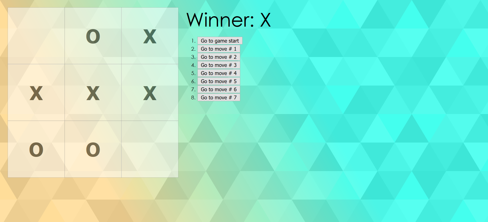

# Tic-Tac-Toe
Following tutorial on React.js docs to make a game.

* passing state down to child components
* importance of maintaining immutability
* .slice() will copy an array instead of mutating the existing array
* Array(x).fill(something) will fill an array with x number of something
* use arrow function to create alerts () => alert ('click')
* aha! the reason for the ( around the return statement is that otherwise if return is on a line on its own, JavaScript will insert a semicolon and you won't get what you want returned
* fun with backgrounds and transparency  
